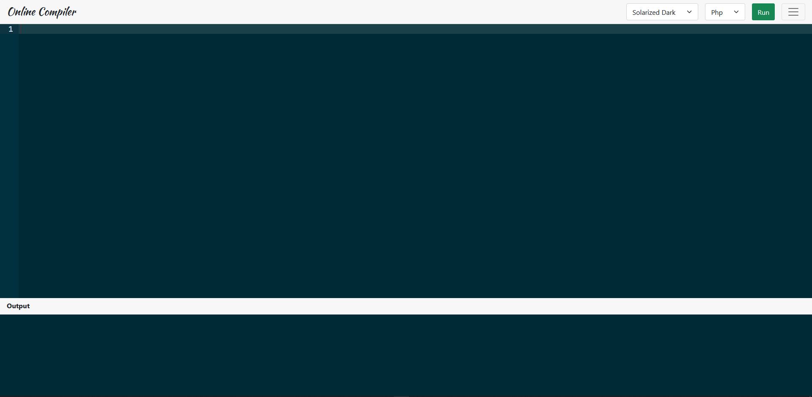

# Online Compiler

An online compiler that compiles and runs Php, Python, C, C++. More languages can be added by adding path to "compiler.php".

- Vim, Emacs, Subime and VSCode Editor can be used in the compiler.

## Screenshot



## To run on localhost

```
git clone https://github.com/Brkgng/Online_Compiler.git
```

```
If you are using Xampp then you have to move Online-Compiler folder to htdocs of Xampp.
If you are using only Apache Server then move to www folder.
```

```
Type http://localhost/Online-Compiler/ from your Browser. Done!
```
